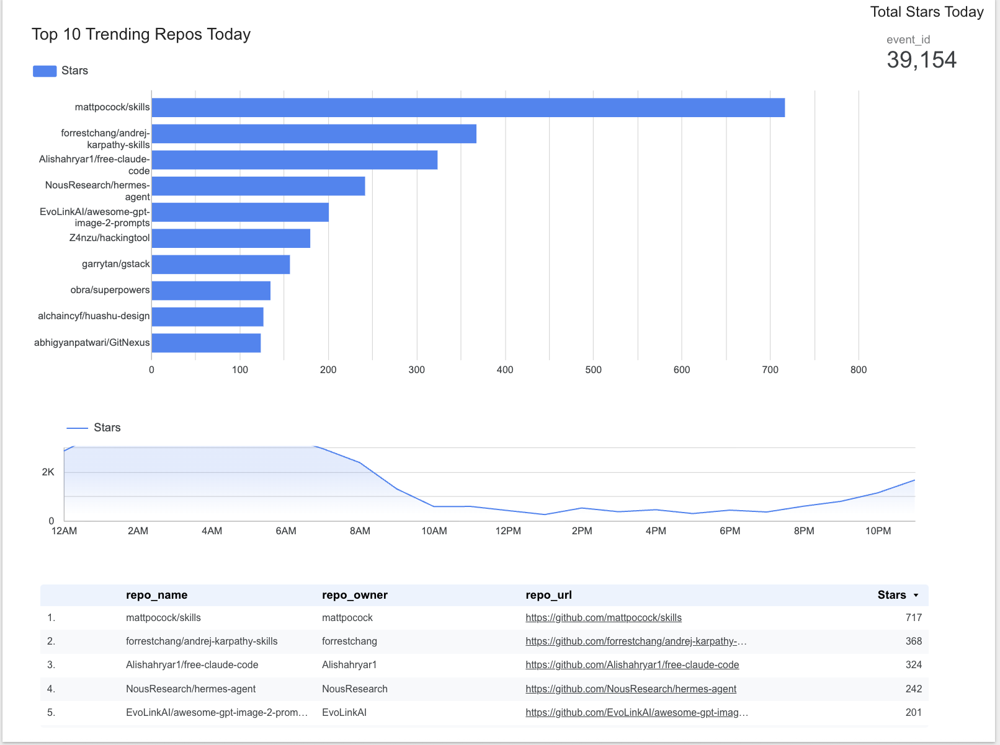
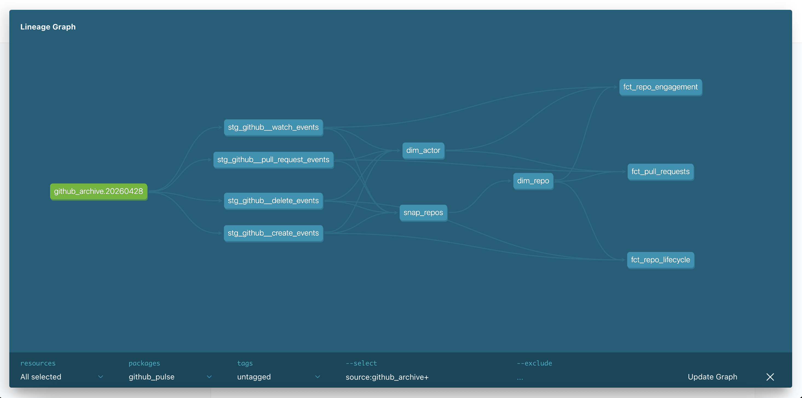

# GitHub Open Source Pulse

End-to-end analytics pipeline tracking the daily pulse of open source —
pull request throughput, merge rate, and trending repositories.

## Live Dashboard

🔗 [View Dashboard](https://datastudio.google.com/reporting/103ac1bd-8de4-47a9-b259-0d34040464fb)



## Architecture
```
GH Archive (BigQuery public dataset)
↓
Staging (dbt views, deduped)
↓
Dims: dim_repo (SCD2) · dim_actor · dim_date
↓
Facts: fct_pull_requests · fct_repo_engagement · fct_repo_lifecycle
↓
Looker Studio Dashboard
```
## Lineage Graph



## Stack

| Layer | Tool |
|---|---|
| Source | GitHub Archive (BigQuery public dataset) |
| Warehouse | BigQuery |
| Transformation | dbt Core 1.11 + dbt-utils |
| Orchestration | GitHub Actions (coming soon) |
| BI | Looker Studio |
| IaC | Terraform (stretch) |

## Key Findings

- **27,015 stars** recorded on 2026-04-28
- Top trending repo: `mattpocock/skills` (497 stars) — reflecting the AI agent skills ecosystem
- Star activity peaks at **2-6AM UTC** (Asia/Europe overlap) and dips mid-day UTC
- **6 of top 10** trending repos are AI agent / Claude skills related — capturing the 2026 open source zeitgeist
- Discovered GH Archive uses at-least-once delivery: 2 duplicate event IDs in source,
  handled via `QUALIFY ROW_NUMBER()` deduplication in all staging models

## Data Caveats

- PR payload simplified in GH Archive 2026: `additions`, `deletions`, `merged` (nested) are NULL
  → merge detection uses top-level `action = 'merged'` instead
- PushEvent payload omits `size` and `commits[]` array → commit-level analysis not possible
- WatchEvent = starring (legacy naming from GitHub API)

## Models

```
models/
├── staging/                    # 1:1 with source event types, deduped
│   ├── stg_github__pull_request_events.sql
│   ├── stg_github__watch_events.sql
│   ├── stg_github__create_events.sql
│   └── stg_github__delete_events.sql
└── marts/
    ├── core/                   # Shared dimensions
    │   ├── dim_date.sql
    │   ├── dim_actor.sql
    │   └── dim_repo.sql        # SCD Type 2 via snapshot
    ├── pull_requests/
    │   └── fct_pull_requests.sql
    ├── engagement/
    │   └── fct_repo_engagement.sql
    └── lifecycle/
        └── fct_repo_lifecycle.sql

snapshots/
└── snap_repos.sql              # SCD Type 2 tracking
```

## Setup

```bash
# Install dependencies
uv add dbt-bigquery
uv run dbt deps

# Configure BigQuery credentials
# Copy profiles.yml.example to ~/.dbt/profiles.yml and fill in your GCP project

# Run pipeline
uv run dbt snapshot
uv run dbt run
uv run dbt test
```